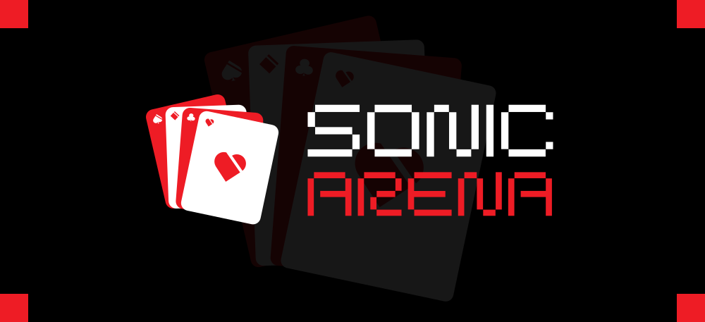
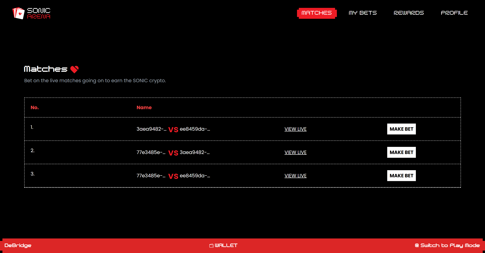
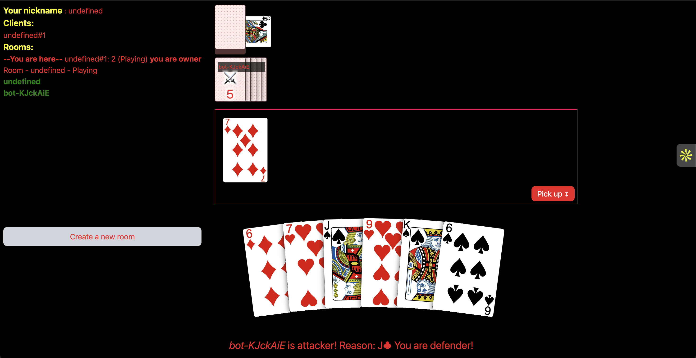
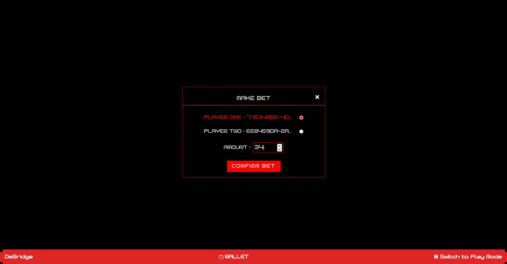
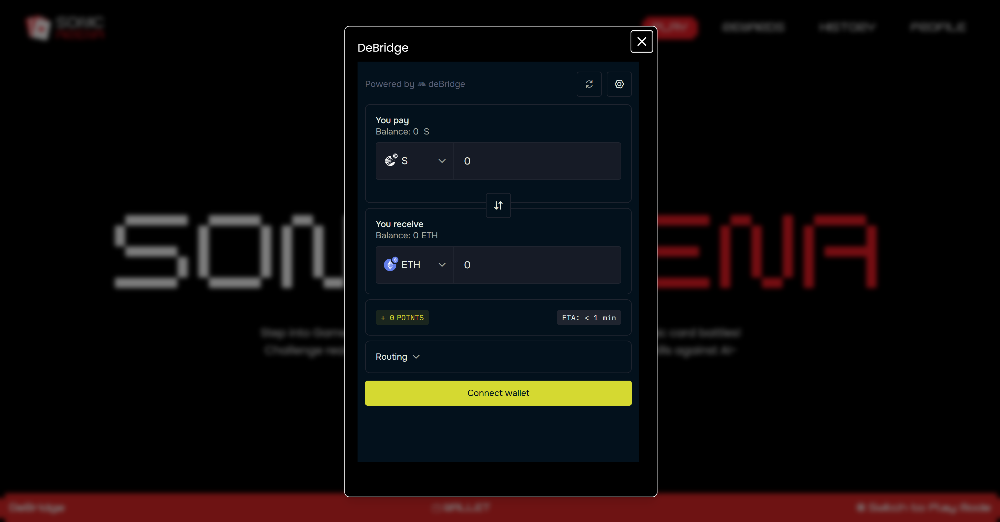

  

  

    <a href="https://www.youtube.com/watch?v=fdfYqqivKq4">View Demo</a>
    .<a href="https://sonic-arena.vercel.app/">Deployed Link</a>
    .
    ·
    <a href="mailto:lcs2022057@iiitl.ac.in">Contact us</a>
    ·
    <a href="https://github.com/Yash7426/Sonicarena/issues">Request Feature</a>
  

## Table of contents 

- [Introduction](#introduction)
- [Motivation](#motivation)
- [Tech stack](#tech)
- [Core Features](#core)
- [Concepts](#concepts)
- [Contributors](#contributors)

# Introduction 

Welcome to SonicArena, a cutting-edge gaming platform designed to redefine competitive gaming by integrating Artificial Intelligence, Decentralized Finance (DeFi), and blockchain technology. Our platform provides an immersive Player vs. Player (PvP) experience alongside an AI-driven training mode that dynamically evolves based on player behavior.

With SonicArena, players can engage in intense real-time battles, place strategic bets using a decentralized betting system, and earn unique NFT rewards based on their engagement and performance. Our AI-powered matchmaking and predictive analytics ensure fairness, transparency, and an enhanced gaming experience for all players.

# SonicArena Architecture

SonicArena integrates AI, DeFi, and Web3 to create an engaging, decentralized gaming experience. The Next.js frontend ensures seamless UI, while AI models (ZerePy, Prophet) analyze player behavior and Twitter sentiment to reward engagement with NFTs. The Solidity-based smart contracts handle in-game transactions, bets, and staking on Sonic Blockchain, with deBridge enabling cross-chain asset transfers. A DeFi-powered betting system allows players to wager SONIC tokens, backed by real-time AI-driven odds. This architecture ensures secure, transparent, and AI-enhanced gameplay, redefining gaming with blockchain and predictive analytics

# Motivation 

The vision behind SonicArena is to transform the gaming ecosystem by combining the best aspects of AI, DeFi, and blockchain. We aim to:
- Create a fair and transparent gaming platform where AI-driven analytics enhance decision-making and strategic gameplay.
- Offer financial incentives through a DeFi-based betting mechanism, ensuring seamless crypto transactions and liquidity.
- Foster an engaging community by rewarding social interactions with unique, tradable NFTs.
- Provide a next-generation training experience where AI bots continuously adapt to player skill levels, making practice sessions more interactive and competitive.

By merging these technologies, SonicArena establishes a new paradigm in gaming that is immersive, rewarding, and future-proof.

# Tech stack 

SonicArena leverages a robust technology stack to ensure high performance and security:

AI and Machine learning models:
- Python & ZerePy:
  - Automate data collection, tweet fetching, posting, and even token transfers on Sonic.
  - Integrate ZerePy’s functions to streamline AI tasks.
- Flask:
  - Serve as the backend server to orchestrate AI models, data pipelines, and API endpoints.
- Sentiment Analysis:
  - Analyze tweets related to specific coins and DEX performance to inform the AI predictions.

Blockchain & Smart Contracts:
- Sonic Blockchain:
  - EVM-compatible, high-performance network for executing trades.
- deBridge:
  - Enables seamless cross-chain asset transfers.
- Solidity, Hardhat/Foundry:
  - For developing, testing, and deploying smart contracts.

Frontend:
- Next.js:
  - Framework for building a responsive, server-side rendered UI.
- Drizzle & Ethers:
  - For interacting with smart contracts on the blockchain.
- NextAuth & SWR:
  - Authentication and data fetching libraries for a smooth user experience.
- Tailwind CSS & Radix-UI:
  - For fast, customizable, and accessible UI components.
- ai-sdk:
  - For integrating additional AI-driven features directly into the frontend.

# Core Features 

### 1. Real-Time PvP Battles
Engage in fast-paced, action-packed real-time Player vs. Player (PvP) battles. The platform ensures fair matchmaking, seamless controls, and an optimized gaming experience through AI-driven game balancing.

### 2. AI-Powered Training Mode
Improve your skills with an AI-driven training mode that continuously adapts to your playstyle. The AI bots analyze player performance and progressively enhance their difficulty, ensuring a challenging and evolving training experience.

### 3. Decentralized Betting System
A transparent DeFi-based betting mechanism enables players to place wagers in multiple cryptocurrencies. Bets are converted into SONIC tokens, ensuring liquidity and a fair betting ecosystem. The system employs AI-powered analytics to predict match outcomes and provide real-time odds.

### 4. Social Rewards & NFT Distribution
Players earn exclusive, collectible NFTs based on their social interactions and engagement.Social interactions on Twitter are tracked using ZerePy for sentiment analysis, and players are rewarded with NFTs based on their engagement.

### 5. Cross-Chain Liquidity & Integration
Seamlessly transfer assets across different blockchain networks using deBridge technology. This feature enhances gaming liquidity, reduces transaction costs, and ensures interoperability with multiple crypto ecosystems.

# Concepts 

- [AI-Powered Bots  For Upskilling Purpose](./docs/AI_Analytics.md)
- [Decentralized Betting Mechanism with Liquidity Optimization](./docs/DeFi_Betting.md)
- [Dynamic NFT Rewards & Community Engagement](./docs/NFT_Rewards.md)
# Contributors

The following individuals have contributed to this project:

### 1. [Yash Agarwal](https://github.com/Yash7426)
- Role: Full Stack Developer

- Responsibilities:

1. Frontend Development: Build an intuitive and responsive UI for Sonic Arena using **Next.js and Tailwind CSS.  
2. State Management & Data Fetching: Utilize **SWR for efficient API handling and Drizzle ORM for structured database interactions.  
3. Authentication & Security: Implement secure authentication with **NextAuth.js for user accounts, session handling, and permissions.  
4. Game UI & Interaction: Develop interactive elements for Sonic Arena, such as battle mechanics, real-time leaderboards, and profile dashboards.  
5. Blockchain Integration: Connect with smart contracts using **Ethers.js for managing in-game assets, tokenized rewards, and staking interactions.   

### 2. [Mayank Rawat](https://github.com/smayank1214)
- Role: UI/UX Designer  

- Responsibilities:  

1. Game UI/UX Design – Craft visually appealing and intuitive interfaces for Sonic Arena, ensuring a seamless experience for players.  
2. Wireframing & Prototyping – Design wireframes and interactive prototypes in Figma to streamline player interactions.  
3. Consistency & Branding – Maintain a cohesive visual identity using Radix-UI components and Tailwind CSS.   
4. User Testing & Feedback – Gather user insights to refine and enhance the player experience.  

### 3. [Darsh Baxi](https://github.com/darshbaxi)
- Role: AI and ML Developer  

- Responsibilities:  
 
1. Game Analytics & Insights – Implement machine learning models to analyze player behavior, win rates, and performance metrics.  
2. Sentiment Analysis for Player Engagement – Use ZerePy for community sentiment tracking to adapt in-game rewards and engagement strategies.  

### 4. [Aviral Hatwal](https://github.com/cyberviking5)
- Role: Blockchain Developer  

- Responsibilities:  

1. Secure Smart Contracts – Ensure robust and exploit-proof staking contracts for game tokenomics.  
2. Game Token Economy – Develop and optimize staking rewards, APY calculations, and token utility.  
3. NFT Integration – Enable NFT-based skins, power-ups, and in-game collectibles through smart contracts.  
4. Cross-Chain Asset Transfers – Integrate DeBridge to enable seamless token movement between chains for in-game purchases and staking.  
5. Smart Contract Development – Build and optimize contracts for cross-chain gaming assets and reward distribution.  
6. Gas Fee Optimization – Improve contract efficiency to reduce gas fees for token interactions within Sonic Arena.  
7. Interoperability with DeFi Protocols – Ensure in-game assets can be seamlessly used across DeFi platforms for staking, lending, and yield farming. 
---

Feel free to [submit an issue](https://github.com/Yash7426/Sonicarena/issues) or [contact us](mailto:lcs2022057@iiitl.ac.in) for feature requests or questions. We hope SuperSonic empowers you to capture profitable arbitrage opportunities with ease and efficiency. Happy trading!

---

🚀 SonicArena is setting the stage for the future of decentralized gaming—join us in shaping the next-gen gaming ecosystem!